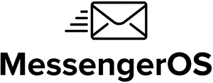

**This library allows you to quickly and easily send emails, SMSes and web push notifications with MessengerOS API via PHP**

# Table of Contents

* [Installation](#installation)
* [Quick Start](#quick-start)
* [About](#about)

<a name="installation"></a>
# Installation

## Prerequisites

- Compatible with PHP Version 7.4 and above.
- A MessengerOS active account is needed - we offer 3,000 free emails each month, **without adding our logo to your emails**. You need more? 
Check our [pricing here](https://messengeros.com/pricing-plans/).

## Setup Environment Variables

1. Copy the sample env file to a new file named `.env`
```bash
cp .env.sample .env
```
2. Edit the `.env` file to include `the following API KEYS` that live in your MessengerOS account.

````bash   
MESSENGER_OS_USER_KEY - from your account information
MESSENGER_OS_PROJECT_KEY - from the current project dashboard 
MESSENGER_OS_EMAIL_DELIVERY_PROVIDER_KEY - from the Delivery Channel information  
MESSENGER_OS_SMS_DELIVERY_PROVIDER_KEY - from the Delivery Channel information 
MESSENGER_OS_SEND_URL="https://inbound.messengeros.com/1.0/send"
````

## Install Package

```bash
composer require messenger_os/messenger_os-php
```

<a name="quick-start"></a>
# Quick Start

Include the proper lines from below at the top of each example based on your installation method:

```php
<?php
// Uncomment the next line if you're using a dependency loader (such as Composer) (recommended)
// require 'vendor/autoload.php';

// Uncomment the next line if you're not using a dependency loader (such as Composer),
// replacing <PATH TO> with the path to the messengeros-loader.php file
// require_once __DIR__ . '/../../messengeros-loader.php';
```

## A basic example for sending an email

The following is the minimum needed code to send an email. You may find more examples in our examples class [here](https://github.com/messengerOS/messengerOS-php/blob/v1.4/src/Example/Examples.php)

```php

use MessengerOS\MessengerOS\Model\Email;
use MessengerOS\MessengerOS\Service\ApiService;

$apiService = new ApiService(
    getenv('MESSENGER_OS_USER_KEY'),
    getenv('MESSENGER_OS_PROJECT_KEY'),
    getenv('MESSENGER_OS_SEND_URL')
);

/* Build email recipients list */
$emailRecipients[] = (new Email\EmailRecipient())
    ->setEmail("recipient1@example.com");

$email = new Email\Email();
$email
    ->setFromName("John | My Company")
    ->setFromEmail("john@mycompany.com")
    ->setRecipients($emailRecipients)
    ->setSubject("Hi [first_name], this is my subject line from API")
    ->setPreviewLine("My preview line from API")
    ->setDeliveryProvider(getenv('MESSENGER_OS_EMAIL_DELIVERY_PROVIDER_KEY'))
    ->setReplyTo("no-reply@mycompany.com")
    ->setParams([
        ['first_name' => 'Thomas']
    ]);

// Send only Email notifications //
try {
    $response = $apiService->sendEmails($emails);
    print $response . "\n";
} catch (Exception $e) {
    echo 'Caught exception: ',  $e->getMessage(), "\n";
}

```
<a name="about"></a>
# About

messengeros-php is maintained and funded by [MessengerOS](https://messengeros.com).